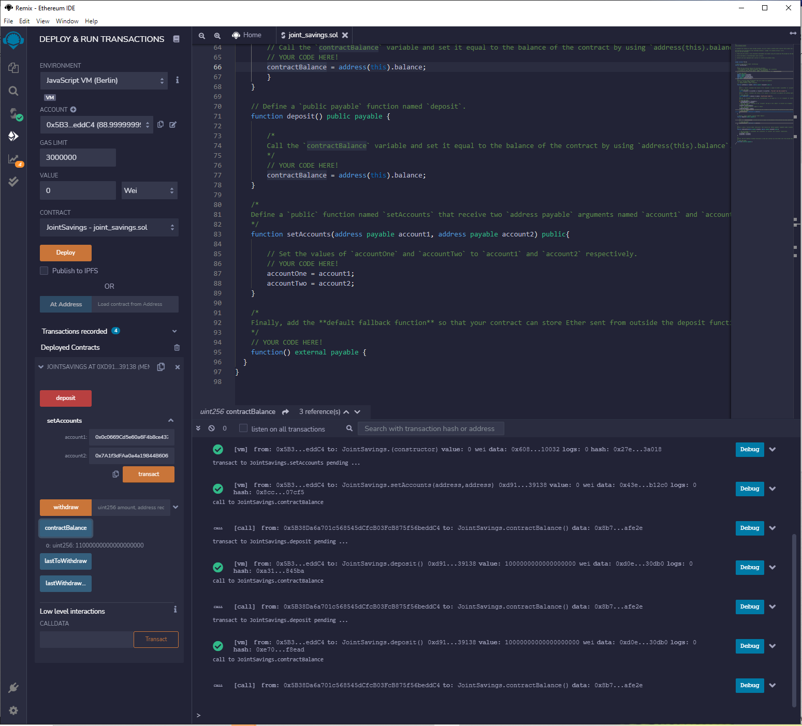
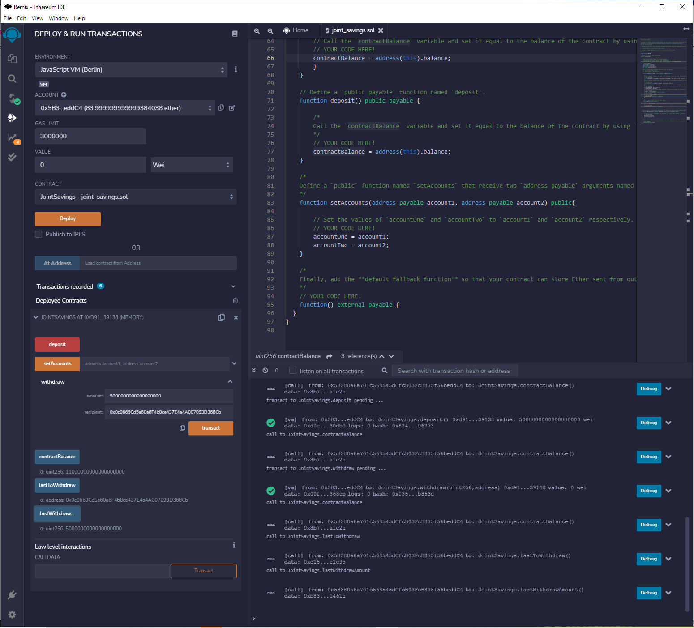

#                                                                                      Smart Contracts - Joint Savings Account

Here we are building Ethereum-compatible blockchain that connects financial institutions. Currently, the team is building smart contracts to automate many of the institutions’ financial processes and features, such as hosting joint savings accounts.

To automate the creation of joint savings accounts, we created a Solidity smart contract that accepts two user addresses. These addresses will be able to control a joint savings account. Smart contract will use ether management functions to implement a financial institution’s requirements for providing the features of the joint savings account. These features will consist of the ability to deposit and withdraw funds from the account.

The first viable product will allow following functionalities,

1.  Create a Joint Savings Account Contract in Solidity
    
2.  Compile and Deploy Your Contract in the JavaScript VM
    
3.  Interact with Your Deployed Smart Contract
    

Code is build, compiled and deployed using REMIX - Ethereum IDE. 

### Compiled Code:


### **Deployed Code**

After successful compilation, we will deploy the code using JavaScript VM environment,


### **Setup Accounts,** we will be using the supplied dummy accounts -

```
Dummy account1 address: 0x0c0669Cd5e60a6F4b8ce437E4a4A007093D368Cb
Dummy account2 address: 0x7A1f3dFAa0a4a19844B606CD6e91d693083B12c0
```


### Deposit 1, 10 and 5 Ether as Wei -

***1 - Ether deposit***


It can be confirmed by looking at contractBalance and the log output that the deposit was successful.

***10 Ether deposit -***



It can be confirmed by looking at contractBalance and the log output that the deposit was successful.

***5- Ether deposit ***


It can be confirmed by looking at contractBalance and the log output that the deposit was successful.

### Withdraw Amount -

***5 ether into*** ***`accountOne`***

******

It can be confirmed by looking at contractBalance and the log output that the withdraw was successful.

***10 ether into `accountTwo`***

******

It can be confirmed by looking at contractBalance and the log output that the withdraw was successful.

### Conclusion:

Looking at the above results, we can conclude that the functionality can be developed and provide the required capability to the firm.